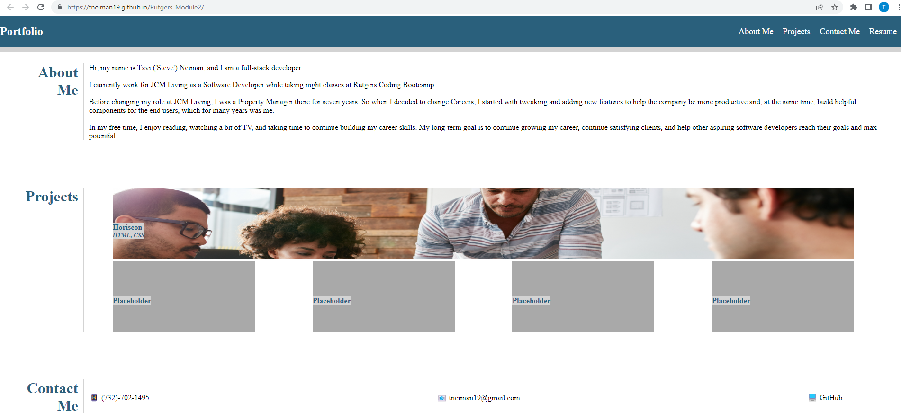

# Rutgers-Module2 (Portfolio Page)
## Task

For this project, we were tasked with building a portfolio page.

The page should consist of the following sections:

# About Me
You should include work, school, and a hobby.

# Projects
The first card in this section should take up a whole line, and the rest can be smaller. 

There is a small section for the project card with the project name and the languages used for that project. 

(I included four placeholder cards for future projects)

# Contact Me

Include a phone number, email address, and GitHub account. You can optionally include social media accounts.

# Resume

In this project, I left a link for a resume in the resume section. When I find time, I can also add it to the HTML.

## Additionally:

Host this on GitHub Pages and include a screenshot in this README file as well

Here is a link to this page: [GitHub Pages Project Link](https://tneiman19.github.io/Rutgers-Module2/)

